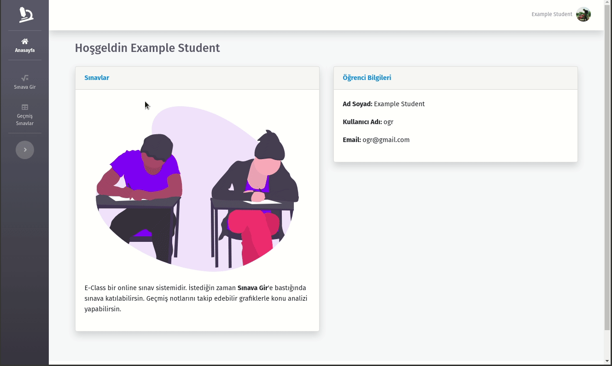
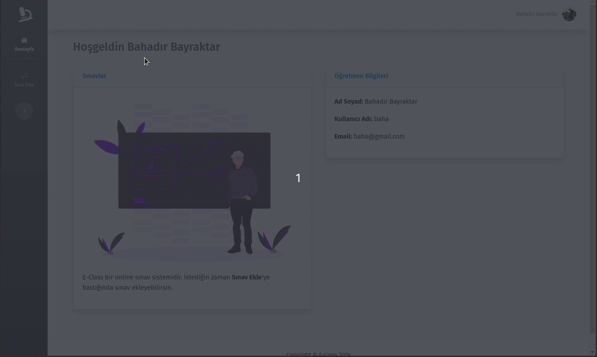

## E-Class

Projemiz öğrencilerin sınav olup öğretmenlerinde öğrenciler için soru ekleyebildiği bir sistem.

## Sınav Olma Ekranı

## Sonuç Ekranları

## Soru Ekleme Ekranı

## Gereksinimler

- [Laravel](https://laravel.com/docs/6.x#installation)
- [Php](https://www.apachefriends.org/tr/index.html)
- [Composer](https://getcomposer.org/doc/00-intro.md)
- [Node.js](https://nodejs.org/en/download/)

## Yükleme
Projeyi indirdikten sonra proje dizinine girip şu komutları çalıştırınız.
    
    composer install
    npm install
    npm run dev

- Yükleme bittikten sonra proje dizinindeki .env.example dosyasını kopyalayıp ismini .env yapınız ve veritabanı bilgilerini giririniz.

İşlem bittikten sonra proje dizininde ağağıdaki komutları çalıştırınız
    
    php artisan key:generate
    php artisan migrate:fresh --seed
    php artisan serve
    
Komut satırında oluşturulan urlden uygulamayı kullanmaya başlayabilirsiniz.

- Öğrenci hesabı için kullanıcı adı: ogr şifre: 123
- Matematik Öğretmeni için kullanıcı adı: baha şifre: 123
- Fizik Öğretmeni için kullanıcı adı: emre şifre: 123

